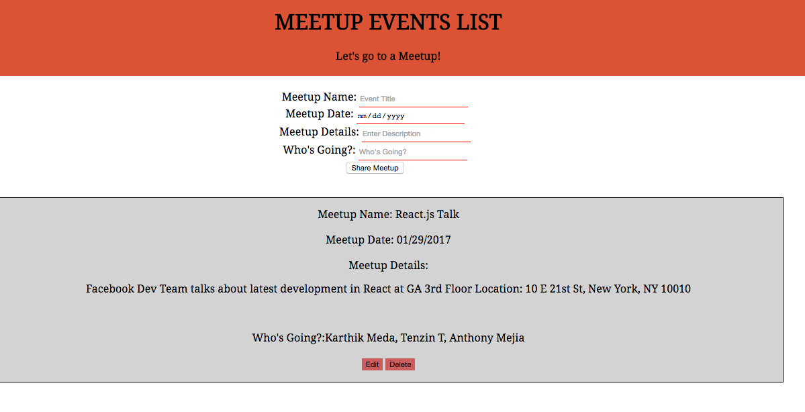

# <center> MEETUP EVENTS LIST </center>
<br>




## Implementation
As stated in project requirements, I used React, and made sure to use multiple components. I created four components App, Input, Events, and EventFeed. I was able to style in CSS using Flexbox as well as utilizing Google fonts.


## Technologies Used

For this project I used :
- Javascript
- React
- Axios
- Moment
- HTML
- CSS (Flexbox)


## Code Example from Events Component

```javascript
import React from 'react';
import axios from 'axios';
import moment from 'moment';

class Events extends React.Component {
  constructor(){
    super();
    this.state= {
      edit:false
    }
  }
  eventDelete(key) {
    axios.delete(`https://meetupevents-b6661.firebaseio.com/${key}.json`)
    .then((res) => {this.props.getEvents();
                   this.props.addEvent();
                 })
  }

  eventEdit(key) {
    this.setState({edit: !this.state.edit})
    axios.patch(`https://meetupevents-b6661.firebaseio.com/${key}.json`, {
      title:this.edittitle.value,
      eventdate:moment(this.editdate.value).format('MM/DD/YYYY'),
      people:this.editpeople.value,
      description:this.editdescr.value,
    })
    .then((res) => {
      this.props.getEvents();
      this.props.addEvent();
    })
  }

  editDisplay() {
    const { events } =this.props;
    return (
      <div>
        Meetup Name:<textarea ref={(text)=>this.edittitle=text} defaultValue={events[this.props.toShow].title} className="edit-field" /><br/>
      Meetup Date:<input type="date" ref={(input) => this.editdate = input} defaultValue={events[this.props.toShow].eventdate} className="event-input" /><br/>
        Meetup Details:<textarea ref={(text)=>this.editdescr=text} defaultValue={events[this.props.toShow].description} className="edit-field" /><br/>
        Whos Going:<textarea ref={(text)=>this.editpeople=text} defaultValue={events[this.props.toShow].people} className="edit-field" /><br/>
        <button type="submit" onClick={() => this.eventEdit(this.props.toShow)} className="clean">
        Save
        </button>
        <button type="submit" onClick={()=> this.setState({edit:!this.state.edit})}>
          Cancel
        </button>
      </div>

    )
  }

  regDisplay() {
    const { events } = this.props;
    return (
    <li className="eachLi">
      <span className="list-field">Meetup Name: </span> {events[this.props.toShow].title}<br/>
      <br/>
      <span className="list-field">Meetup Date: </span> {events[this.props.toShow].eventdate}<br/>
      <br/>
      <span className="list-field">Meetup Details: </span> <p>{events[this.props.toShow].description}</p><br/>
      <br/>
      <span className="list-field">Whos Going?: </span>{events[this.props.toShow].people}<br/>
      <div className="buttons">
      <br/>
      <button type="submit" onClick={() => this.eventEdit(this.props.toShow)} className="clean">Edit</button>
      <button type="submit" onClick={() => this.eventDelete(this.props.toShow)} className="clean">Delete</button>
    </div>
  </li>
    )
  }
  render() {
    if(!this.state.edit){
      return (this.regDisplay());
    }
    else{
      return (this.editDisplay());
    }
  }
}


export default Events;


```

## Build Strategy

My strategy was for my project to be an event manager website, or an event list app for relevant Meetup Events for our cohort or any group of people. Initially I wanted fetch data from an external Meetup API, but that would not have met the CRUD requirements for this project. The Events component is a child of EventFeed and EventFeed renders in or is a child of App.js. Input component is a child of App. The data from the input fields in Input is stored via values derived from ref on each field. This is then posted to a Firebase database (via a relevant url) using axios. The data posted is then fetched via axios and passed to the events object, which is stored/set in state within App (getEvents function within App component- Line 30). The edit and delete functions on each event are defined and called in the Events component, and accessed/referenced via the unique key firebase  assigns each event. This is done by using the map function over the keys of the events object in state within App. (Refer to Line 42 in App component within addEvent function).Additionally, an edit boolean is set in state within events. When false the event list will render as normal via regDisplay function  if edit is true, it will render the text area fields for all attributes of each event list item. (refer to lines 19,33,52,71 in Events). the edit boolean is changed within eventEdit function and is called on click of the Edit button.


## Contributors
The main contributor is GA and Hakuna Matata, who helped me come up with the logic of a word game, through class work and the tweedr app exercise. Patrick through one-on-one sessions and wireframing my project in Balsamiq, helped me stay focused on deliverables for this project, what to pay attention to and what to .

## Complications/Future Improvements

- I would like to add location data from Google maps as additional info in addition to more relevant info for each Meetup

- Be able to filter or search Meetup Events by keywords from the event details, one of the names of the people going, or date.

- I could not figure out how to properly use React Router and would like to have a more intuitive and cleaner interface for the user.

- I would like to add more dynamic and attractive styling via CSS and Bootstrap, and will look to make those improvements


## Authors

- Karthik Meda
- General Assembly
- Patrick Andre
